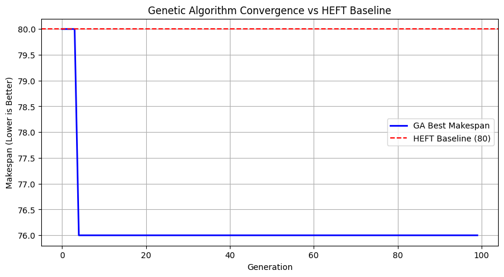
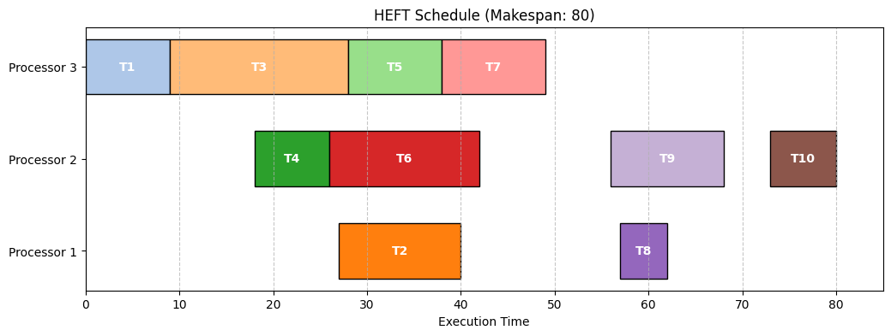
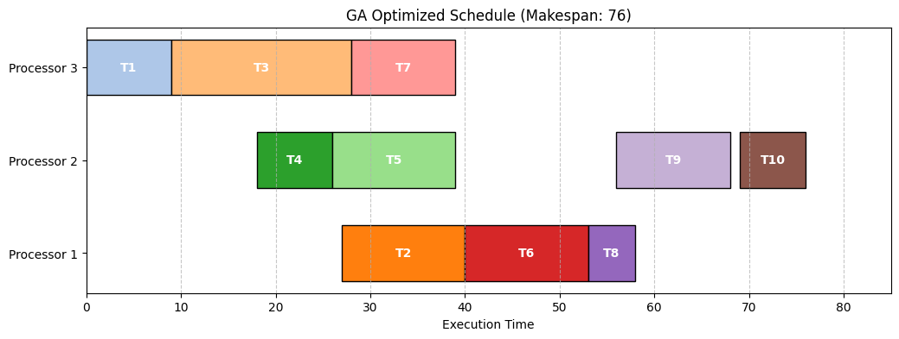

# Multiprocessor Task Scheduling Optimization: HEFT vs. Hybrid GA

[]()
[]()[]()

[]()

A Python-based simulation framework designed to solve the NP-hard problem of scheduling dependent multiprocessor tasks onto heterogeneous hardware. This project compares the industry-standard **Heterogeneous Earliest Finish Time (HEFT)** heuristic against a custom **Hybrid Genetic Algorithm (GA)** to minimize total execution time (Makespan).

---

##1. The Engineering Challenge

Modern computational workloads—such as machine learning pipelines and real-time signal processing—are modeled as **Directed Acyclic Graphs (DAGs)** where tasks have strict execution dependencies. The scheduler must solve a complex two-fold optimization problem under hardware constraints:

* **Parallelization vs. Latency:** Distributing dependent tasks across heterogeneous processors utilizes parallel computing power, but transfers across different cores incur network communication latency ($c_{i,j}$).
* **Greedy Traps:** Standard heuristics often prioritize immediate local execution times, inadvertently creating massive downstream network bottlenecks when dynamic communication delays are introduced.

---

##2. Solution Architecture

We engineered a two-phase algorithmic framework to escape local optima and optimize global task placement:

1. **Deterministic Baseline (HEFT):** Implemented an upward-rank list-scheduling algorithm that prioritizes tasks along the critical path and greedily assigns them to processors to minimize Earliest Finish Time (EFT).
2. **Meta-Heuristic Optimizer (Hybrid GA):** Developed a Genetic Algorithm seeded directly with the HEFT output to accelerate evolutionary convergence. The GA employs **Topological Height-Based Priority Encoding** to guarantee 100% precedence-compliant chromosomes during crossover and mutation phases.

---

##3. Benchmarks & Performance Results

Evaluated against the standard 10-task reference DAG from *Topcuoglu et al. (2002)* on a 3-processor heterogeneous system:

| Algorithm | Makespan ($C_{max}$) | Strategic Strategy Profile |
| :--- | :---: | :--- |
| **HEFT Baseline** | 80 units | Deterministic, local greedy search |
| **Hybrid GA (Ours)** | **76 units** | Global meta-heuristic search + Topological seeding |
| **Net Optimization** | **-5.0%** | **Reduction in total execution time** |

> **Key Takeaway:** The Hybrid GA learned to intentionally delay specific tasks locally, eliminating high-latency inter-processor communication overhead ($c'_{i,j} = 0$) and optimizing overall system throughput.

---

##4. Visualizations

### (a). Evolutionary Convergence
The hybrid seeding strategy enables the GA to start at the HEFT baseline upper bound ($C_{max} = 80$) and continuously mutate processor assignments to discover global optima ($C_{max} = 76$).



### (b). Schedule Execution Analysis
Comparative Gantt charts illustrating task sequencing and resource allocation across processors:

* 

* 
---

##5. Quickstart Guide

### Running in Google Colab
Click below to open the interactive notebook directly in Colab:

[](https://colab.research.google.com/github/Namain231/GA_Task_Scheduler/blob/main/GA_Task_Scheduler.ipynb)

###6. Local Setup
1. **Clone the repository:**
   ```bash
   git clone [https://github.com/Namain231/dag-multiprocessor-task-scheduling.git](https://github.com/Namain231/dag-multiprocessor-task-scheduling.git)
   cd dag-multiprocessor-task-scheduling
   ```
2. **Install required dependencies.**
   ```bash
    pip install -r requirements.txt
   ```
3. Run the notebook.

## 📄 References

* **Topcuoglu, H., Hariri, S., & Wu, M. Y. (2002).** Performance-effective and low-complexity task scheduling for heterogeneous computing. *IEEE Transactions on Parallel and Distributed Systems*, 13(3), 260-274.
* **Hou, E. S., Ansari, N., & Ren, H. (1994).** A genetic algorithm for multiprocessor scheduling. *IEEE Transactions on Parallel and Distributed Systems*, 5(2), 113-120.
